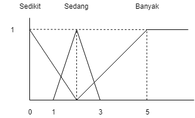
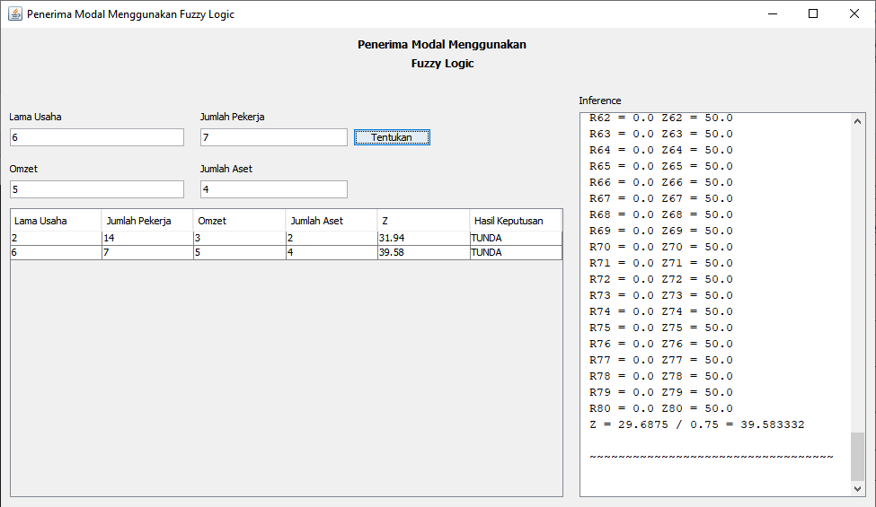

# Fuzzy
Fuzzy Logic untuk pendukung keuputusan penerima modal UMKM  
Fuzzy Logic for supporters of capital recipients

<h3>1. Fuzzification Jumlah Aset</h3>

<h3>2. Fuzzification Jumlah Pekerja</h3>

<h3>3. Fuzzification Lama Usaha</h3>

<h3>4. Fuzzification Omzet</h3>

<h3>Screenshot</h3>

